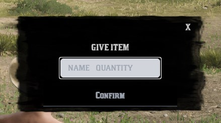

#Vorp Inputs

> VORP inputs is a tool that is mandatory within the vorp framework. 

[`VORP INPUTS LUA`](https://github.com/VORPCORE/vorp_inputs-lua) **download**

## API Docs

### Single input
<Badge type="warning" text="Client Side Only" /> 

```lua
local button = "Confirm" --label
local placeholder = "Insert player ID" --label

    TriggerEvent("vorpinputs:getInput", button, placeholder, function(result)

        if result ~= "" or result then -- making sure its not empty or nil
            print(result) -- returs a string
        else
            print("its empty?") -- notify
        end
    end)

```


### With input Type
<Badge type="warning" text="Client Side Only" /> 

```lua
    local button = "Confirm"
    local placeholder = "Test Here"
    local inputType = "input" -- number ,textarea , date, etc.
    TriggerEvent("vorpinputs:getInput", button, placeholder,inputType, function(result)

        if result ~= "" or result then -- making sure its not empty or nil
            print(result) -- returs a string
        else
            print("its empty?") -- notify
        end
    end)
```

### Advanced inputs 

<Badge type="warning" text="Client Side Only" /> 

```lua

local myInput = {
    type = "enableinput", -- don't touch
    inputType = "input", -- input type
    button = "Confirm", -- button name
    placeholder = "NAME QUANTITY", -- placeholder name
    style = "block", -- don't touch
    attributes = {
        inputHeader = "GIVE ITEM", -- header
        type = "text", -- inputype text, number,date,textarea ETC
        pattern = "[0-9]", --  only numbers "[0-9]" | for letters only "[A-Za-z]+" 
        title = "numbers only", -- if input doesnt match show this message
        style = "border-radius: 10px; background-color: ; border:none;"-- style 
    }
}

TriggerEvent("vorpinputs:advancedInput", json.encode(myInput), function(result)
    
    if result ~= "" and result then -- make sure its not empty or nil
        print(result) --returns string
    else
        print("it's empty?") --notify
    end
end)

```
- Input Export synchronous 

```lua
local myInput = {
    type = "enableinput", -- don't touch
    inputType = "input", -- input type
    button = "Confirm", -- button name
    placeholder = "NAME QUANTITY", -- placeholder name
    style = "block", -- don't touch
    attributes = {
        inputHeader = "GIVE ITEM", -- header
        type = "text", -- inputype text, number,date,textarea ETC
        pattern = "[0-9]", --  only numbers "[0-9]" | for letters only "[A-Za-z]+" 
        title = "numbers only", -- if input doesnt match show this message
        style = "border-radius: 10px; background-color: ; border:none;"-- style 
    }
}
local result = exports.vorp_inputs:advancedInput(myInput)
```



-------
## Devtips

 **split a string into more than one separated by a space**

 ```lua

local result = yourvariable
local splitString = {}
      for i in string.gmatch(result, "%S+") do
         splitString[#splitString + 1] = i
       end
local data1, data2 = splitString[1],splitString[2]

print(data1,data2)

 ```

 ```lua 

 -- use can use these to make sure what you want the input to be.
 tostring(data1) -- returns string
 tonumber(data2) -- returns number

 ```
------


