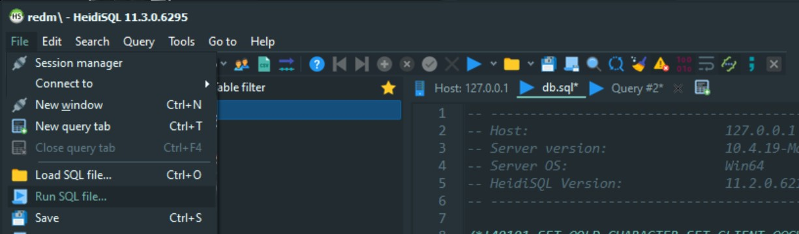
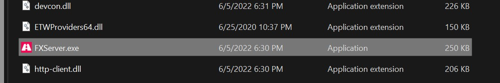
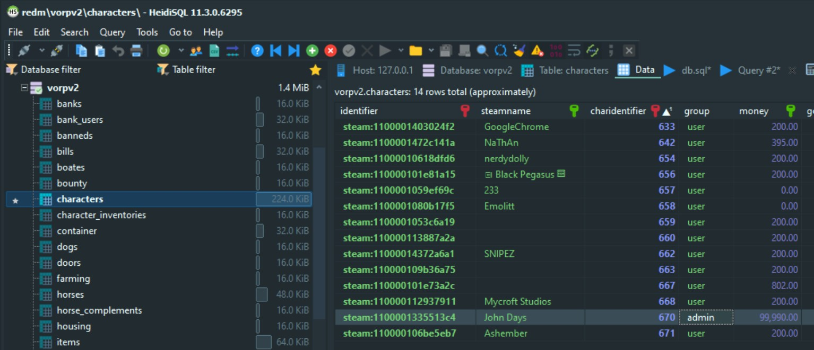

## **GETTING STARTED**

### Install the following
- RDR2 or RDO <Badge type="warning" text="Both work for RedM" /><Badge type="tip" text="RDO is cheaper!" />
- login to steam <Badge type="tip" text="Required in all cases" />
- login to rockstars launcher <Badge type="info" text="Only if purchased on Rockstar" />

### Download the following

- [`MariaDB`](https://mariadb.org/download) For **connecting** to the database. _(Version 10.11.2 Recommended)_ <Badge type="warning" text="MySQL is not supported" />

- `HEIDI SQL` to **manage** the database _(This is included in the MariaDB download)_

## **HOSTING YOUR SERVER**
:::warning
we support only **WINDOWS**, **linux** is not officially supported
:::

You have many options when hosting:
1. Self Hosting, _We do not recommend this for a live server_
2. Choose a **Windows VPS** to host your server. [`GOOGLE IT`](https://www.google.com)


## INSTALLATION

### Download Premade
- [`Download`](https://github.com/VORPCORE/vorp_pre-made) the **premade server** OR [`Download`](https://github.com/VORPCORE/VORP_txAdmin) the **txadmin recipe**
- After downloading, follow the instuctions in the given repo to install the server, then continue bellow.

### Configuration & Permissions

Edit the **server.cfg** found at 📁``server/server.cfg``

:::warning
 You **MUST** edit these for your server to work you can find how by looking at the file mentioned above.
:::

```lua
 sv_licenseKey ""
 set steam_webApiKey "" -- this is required for vorp
 sv_hostname "my server" 
 sv_projectDesc "my project"
 sv_maxclients 48 --with onesync on 

```

### Permissions & TX Admin
---

- Install MariadDB for your databse
- Install and run   **HeidiSQL** the SQL file  `MariaDB.sql` found in the directory of the [`premade`](https://github.com/VORPCORE/vorp_pre-made) server
- Create where it says **New** any name you want
- Add password and user name if you installed with one (password must be placed as well in your server.cfg)





- Then run the file
- **Ignore the warnings!**


- Start `FXServer.exe` and it will open a web browser to install **TX admin** follow the options. and your server should start








- Done! Your server is installed


:::warning
 NOTE: some of the plug-ins from the [`premade`](https://github.com/VORPCORE/vorp_pre-made) are not updated make sure to check [`VORP GitHub`](https://github.com/VORPCORE) to update them.
:::

---

## DISCLAIMER

_VORP does not guarantee any support or that any script will work_


